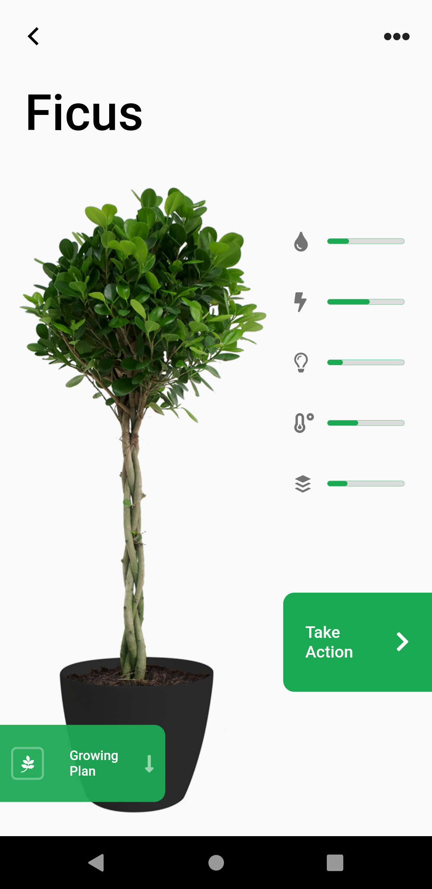
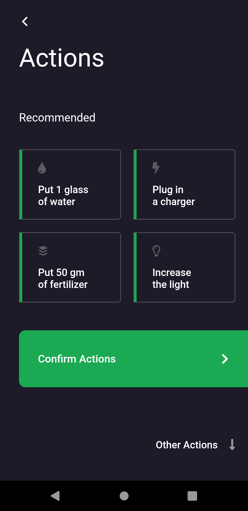
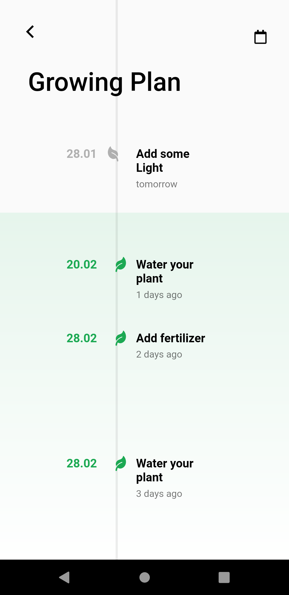

# Growing Plants IoT - FLutter App

This amazing App UI is built on the amazing design of [Den Klenkov](https://dribbble.com/denklenkov "Den Klenkov") for [Fireart Studio](https://dribbble.com/Fireart-d "Fireart Studio") team.

- Original UI design: [Here](https://dribbble.com/shots/6522758-IoT-App-for-growing-plants "Original Design")
- For more Flutter apps: [From Here](https://github.com/AhmedAbouelkher "profile")
- Live Demo: [From Here](https://youtu.be/wZZX123ohpE "App Demo")  

## Design

## Implementation

     